```mermaid
flowchart TD
  START_FLOW["MULAI"]
  START_FLOW --> SUP["Supervisor (buat SPK)"]

  SUP --> CREATE["Buat Penugasan (SPK)<br/>- Pilih kategori, lokasi, tanggal<br/>- Tentukan scope & frekuensi"]

  CREATE --> ASSIGN["Assign: Teknisi & Alat<br/>- Bisa multiple teknisi & multiple alat<br/>- Lock stok untuk alat yang dipinjam"]

  ASSIGN --> NOTIF_TECH["Notifikasi ke Teknisi (assignment)"]
  NOTIF_TECH --> TECH["Teknisi terima & konfirmasi tugas"]

  TECH --> START_WORK["Teknisi Check-in (GPS) — Mulai kerja"]
  START_WORK --> WORK["Pelaksanaan Pekerjaan — Dokumentasi progress berkala"]
  
  %% Perpanjangan
  WORK --> CHECK_EXT{"Perlu Perpanjangan?"}
  CHECK_EXT -->|Ya| REQ_EXT["Teknisi: Request Perpanjangan"]
  REQ_EXT --> APPROVE_EXT{"Supervisor setuju?"}
  APPROVE_EXT -->|Approve| UPDATE_DEADLINE["Update deadline → Notifikasi ke teknisi"]
  APPROVE_EXT -->|Reject| NOTIF_REJECT["Notifikasi penolakan ke teknisi"]
  UPDATE_DEADLINE --> WORK
  NOTIF_REJECT --> WORK

  %% Laporan (loop sampai selesai)
  WORK --> SUBMIT_PROGRESS["Teknisi submit laporan berkala<br/>- Foto before/after **wajib** per laporan<br/>- Persentase, catatan<br/>Status: Menunggu | Sedang Dikerjakan<br/>Hampir Selesai | Selesai<br/>(Return alat hanya tersedia jika status = Selesai)"]
  SUBMIT_PROGRESS --> NOTIF_SUP["Notifikasi ke Supervisor (cek laporan)"]
  NOTIF_SUP --> VALIDATE{"Supervisor Validasi Laporan?"}

  VALIDATE -->|Ditolak| REJECT_REASON["Supervisor: catatan & tolak"]
  REJECT_REASON --> NOTIF_TECH_REJECT["Notifikasi tolak → teknisi revisi"]
  NOTIF_TECH_REJECT --> RESUBMIT["Teknisi revisi & submit ulang"]
  RESUBMIT --> SUBMIT_PROGRESS

  VALIDATE -->|Disetujui| CHECK_FINAL{"Apakah ini laporan final<br/>& semua final disetujui?"}
  CHECK_FINAL -->|Belum| CONTINUE["Lanjutkan pekerjaan (loop)"]
  CONTINUE --> WORK

  %% Finalisasi penugasan
  CHECK_FINAL -->|Ya| TO_PENDING["Tandai: Penugasan → <br/> Menunggu Validasi Final"]
  TO_PENDING --> SUP_FINAL["Supervisor: Review semua <br/> laporan<br/>-Selesaikan Penugasan"]
  SUP_FINAL -->|Selesaikan| RETURN_TOOLS["Proses Pengembalian Alat<br/>(partial allowed)"]
  SUP_FINAL -->|Tunda| CONTINUE

  RETURN_TOOLS --> RESTOCK["Update inventori & unlock alat<br/>yang dikembalikan"]
  RESTOCK --> COMPLETE["Status: SELESAI (Closed) — Arsip & laporan akhir"]
  COMPLETE --> END_FLOW["SELESAI"]

  %% Manager
  MAN["Manager (view-only)"] -.->|Monitoring| MON["Monitoring Dashboard & Analisis"]
  MON -.-> MAN

  %% Visual styles (high contrast)
  style START_FLOW fill:#16a34a,stroke:#0f766e,stroke-width:1px
  style END_FLOW fill:#dc2626,stroke:#7f1d1d,stroke-width:1px
  style COMPLETE fill:#1d4ed8,stroke:#1e40af,stroke-width:1px
  style VALIDATE fill:#d97706,stroke:#92400e,stroke-width:1px
  style APPROVE_EXT fill:#d97706,stroke:#92400e,stroke-width:1px
  style CHECK_FINAL fill:#d97706,stroke:#92400e,stroke-width:1px
  style MAN fill:#374151,stroke:#111827,stroke-width:1px
  style MON fill:#374151,stroke:#111827,stroke-width:1px
```

---

ASCII fallback (ringkas & readable):

```text
Supervisor
  ↓
Buat Penugasan (SPK)
  - Pilih kategori, lokasi, tanggal
  - Tentukan scope & frekuensi
  ↓
Assign Teknisi & Alat (multiple)
  - Pilih teknisi, jumlah alat
  - Lock stok jika dipinjam
  ↓
Teknisi check-in (GPS) → Mulai kerja
  ↓
Pelaksanaan pekerjaan (dokumentasi berkala)
  ↓
Teknisi submit laporan:
  - Status: Menunggu | Sedang Dikerjakan
    | Hampir Selesai | Selesai
  - Foto before/after **wajib** setiap laporan; lampirkan persentase & catatan
  - Return alat hanya jika status = Selesai
  ↓
Supervisor validasi:
  - Jika Ditolak → Teknisi revisi & submit ulang (loop)
  - Jika Disetujui:
    - Jika laporan final & semua final disetujui:
      → Tandai Menunggu Validasi Final → Supervisor finalisasi → Proses pengembalian alat (partial allowed) → Update inventori → SELESAI (Closed)
    - Jika belum final → Lanjutkan pekerjaan (loop)

Manager: view-only (monitoring & analisis)

Catatan persentase yang direkomendasikan:
- Menunggu: 0-10%
- Sedang Dikerjakan: 11-75%
- Hampir Selesai: 76-99%
- Selesai: 100%
```
